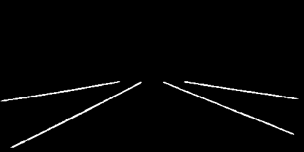

# LaneNet-Lane-Detection 
A Deep Neural Network for real time lane detection mainly based on the paper https://arxiv.org/abs/1802.05591.
This implementation is an extension of [MaybeShewill](https://github.com/MaybeShewill-CV/lanenet-lane-detection), that uses as input data images generated from the simulation program [Speed Dreams](http://www.speed-dreams.org/)

## Installation
This software has been tested on ubuntu 16.04(x64), python3.5, cuda-10.0, cudnn-7.4.1.5 with a RTX-2080 GPU and a TITAN V. 
To install this software you need at least tensorflow 1.10.0 or higher (works for 1.11 and 1.12 as well)
```
pip3 install -r requirements.txt
```

## Test model
In order to test the network download the trained lanenet model weights files from [model_weights](https://nextcloud.os.in.tum.de/s/model_weights).
Move the file in the folder model/speed_dreams

Testing a single image on the trained model can be executed with the following command:

```
python tools/test_lanenet.py --is_batch False --batch_size 1 
--weights_path path/to/your/model_weights_file 
--image_path data/sample_file/src_image_org.png
```
The results are as follows:

`Test Input Image`


`Test Lane Binary Segmentation Image`



`Test Lane Instance Segmentation Image`


`Test Lane Instance Embedding Image`


If you want to test the model on a whole dataset you may call
```
python tools/test_lanenet.py --is_batch True --batch_size 2 --save_dir data/tusimple_test_image/ret 
--weights_path path/to/your/model_weights_file 
--image_path data/tusimple_test_image/
```
If the save_dir argument is set, the results are saved under this path.

## Train a model
#### Data Preparation
As described above the data is generated based on the simulation program "Speed Dreams". In order to generate a dataset follow the steps in: [matlab-dataset](https://github.com/LukasProgram/LaneNet-Masterwork/tree/master/matlab-dataset). In our case, two datasets were created. The first was split into 200 training images, 50 validation images and 50 test images. The second dataset was split into 400 training images, 50 validation images and 50 test images.The first data set consists mainly of images with straight lanes. On the other hand, the second data set also contains images with curved lanes. Both datasets are available to download here [speed_dreams_dataset](https://nextcloud.os.in.tum.de/s/speed_dreams_dataset)

After generating the dataset, move it to the data folder and use the following command to get a train.txt and a val.txt file.

```
python3 generate_speedDreams_dataset.py
--src_dir /data/
```

The paths in the train.txt file indicate which images are taken for the training. The paths in the val.txt file indicate which images are taken for the validation process. The training samples are consist of three components. Moreover, a binary segmentation label file, an instance segmentation label file, and the original image ate generated, which are required for the training process. The image size for training is scaled based on the value in the config file.

The generate_speedDreams_dataset.py script can be also used to define the size of the validation set and to automatically create it instead of copying and pasting the paths between text files.

```
python3 generate_speedDreams_dataset.py
--src_dir /data/
--val_size "validation set size"
```

#### Train model
In the final training the epoches are 40000, batch size 2. Besides, all training and validation parametes are listed in the global_configuration/config.py

For the encoder stage the [VGG16](https://github.com/tensorflow/models/tree/master/research/slim#pre-trained-models) is used, which need to be download are moved in the data folder. According to [MaybeShewill](https://github.com/MaybeShewill-CV/lanenet-lane-detection), also a dense model can be used. To start the training process the following command must be execuded:

```
python tools/train_lanenet.py 
--net vgg 
--dataset_dir data/training_data_example/
```
You can also continue the training process from the snapshot by
```
python tools/train_lanenet.py 
--net vgg 
--dataset_dir data/training_data_example/ 
--weights_path path/to/your/last/checkpoint
```

After the training is finished the following files are generated under */model*, which are used for inference:
- .cpkf file
- .metadata file
- .model file

## Export model
The above-mentioned files describe the entire lanenet model that must be exported to a form that is
accessible for any mobile application. The process used for this is called "freezing". When freezing the model, all required elements, for example, graph, weights, are identified and saved in a single file.

First, a graph.pb must be generated. For this, the test script was modified to automatically generate a graph.pb.To generate the file use the *test_lanenet_with_pb_extraction.py* instead of *test_lanenet.py*

When a graph.pb is generated and the output nodes names were identified, the model is frozen with the
following command:

```
python3 -m tensorflow.python.tools.freeze_graph
--input_graph graph.pb
--input_checkpoint path/to/model
--output_graph graph_frozen.pb
--output_node_names=
'lanenet_model/inference/decode/score_final/score_final,
lanenet_model/pix_embedding_relu'
```

Since the network is only used for inference, an optimization of the freezed_graph.pb is performed. This optimization removes the operations which have no influence on the result of the network and reduces the amount of required computation when the network is used on a mobile device.

```
python3 -m tensorflow.python.tools.optimize_for_inference
--input graph_frozen.pb --output graph_optmized.pb
--input_names='input_tensor'
--output_names=
'lanenet_model/inference/decode/score_final/score_final,
lanenet_model/pix_embedding_relu'
```

The result is a binary file named graph_optimized.pb, which can be load with the tensorflow API for mobile devices. Our inference graph files are available here [graph_weights](https://nextcloud.os.in.tum.de/s/graph_files)

## Future Work

Recently the LaneNet implementation was updated. In order to allow a better comparison of model weights in the future, the same dataset was traninert with the new implementation. The model weights are available [here](https://nextcloud.os.in.tum.de/s/updated_lanenet_model_weights)

